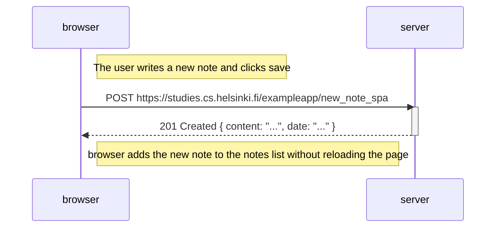

```mermaid
sequenceDiagram
    participant browser
    participant server

    Note right of browser: The user writes a new note and clicks save

    browser->>server: POST https://studies.cs.helsinki.fi/exampleapp/new_note_spa
    activate server
    server-->>browser: 201 Created { content: "...", date: "..." }
    deactivate server

    Note right of browser: browser adds the new note to the notes list without reloading the page
```